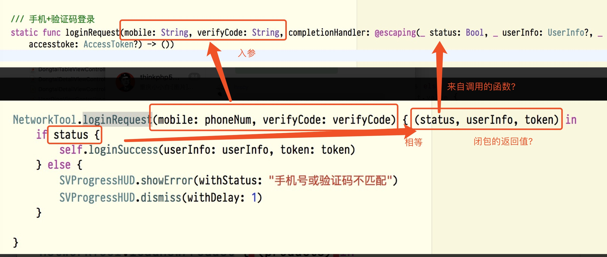
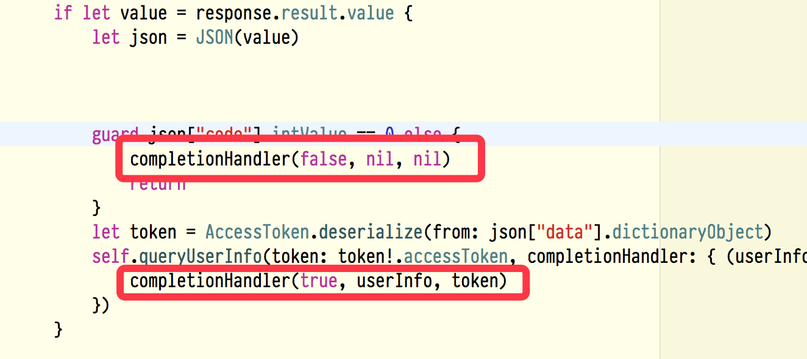

闭包 closure
闭包在Swift中应用广泛，在许多系统库方法中都能看到。
无名
本质是函数
使用时注意循环引用


下一级创建闭包
```swift
  // 1.定义一个闭包类型
    typealias swiftBlock = (_ btnTag : Int) -> Void
    
    // 2. 声明一个变量
    var callBack: swiftBlock?
    
    // 3. 定义一个方法,方法的参数为和swiftBlock类型一致的闭包,并赋值给callBack
    func callBackBlock(block: @escaping swiftBlock) {
        callBack = block
    }
    //4. 调用闭包,设置你想传递的参数,调用前先判定一下,是否已实现
        if callBack != nil {
            callBack!(88) 
        } 
```
闭包回调
```swift
//闭包
cell.callBackBlock { (tag) in
        print(tag) 
    }
```


闭包基础


```swift
//闭包是无名的，因为他们能够从上下文中捕获变量、常量，从而应用在自身的作用区域。 
//声明 
var myClosure: () -> String 
//注意 () -> String 实际上是一个无名函数，作为闭包变量的类型。 
//无返回值的闭包 
myClosure:() -> Void = { print("Hello world") }
//执行闭包 myClosure() 
// Hello world 
//尝试一个带参的闭包 
var mySecondClosure: (Int , Int ) -> Int = { (a: Int , b: Int) -> Int in return a * b } 
//第一次简化 类型自动推导 可以根据参数推断 
mySecondClosure = { (a, b) in return a * b }
//第二次简化 如果函数体只包含一句 return 代码，可省略 
return mySecondClosure = { (a, b) in a * b }
```
```swift
/*
第三次简化 
被捕获的参数列表中，含有a、b，下标从0开始，可通过"$"获取。

编译器亦可通过，捕获列表自行推断出参数。
故可省略参数列表 （a, b）和 关键字 in 
*/
mySecondClosure = {
    $0 * $1
}

闭包作为函数参数

/*
operation: 是一个闭包类型的参数
该闭包有两个参数（Int, Int） ,并有一个Int型返回值

要整体看待，不要蒙圈。
*/
func myOpreation(_ a: Int , _ b: Int, operation: (Int , Int) -> Int) -> Int {
    let res = operation(a, b)
    return res
}

//实现一个闭包
let multipyClosure:(Int, Int) -> Int = {
    $0 * $1
}

//等同于
let multipyClosure = {
    (a: Int, b: Int) in 
    a * b
}

//下面，我们将闭包作为参数传递
myOperation(4, 2, operation:multipyClosure)

//展开 inline
myOperation(4, 2, operation: {
    (a: Int, b: Int) -> Int in 
    return a * b
})


/*
事实上，我们并没有必要在本地定义一个闭包常量或变量，再作为参数传递。
可以简单的在调用的地方进行声明并简化
*/

myOperation(4, 2, operation:{
    $0 * $1
})

//进一步简化，* 操作符是一个有两个参数并返回一个结果的函数。可做如下简化:
myOperation(4, 2, operation: *)

/*
如果闭包是作为函数的最后一个参数，可以将闭包后置到函数体外部。 
*/
myOperation(4, 2) {
    $0 * $1
}

捕获

闭包可以从上下文环境中捕获常量、变量，并在自己的作用域内使用。
//eg.: 1
var counter = 0
let incrementCounter = {
    counter += 1    
}

/*
由于闭包定义和变量counter在同一作用域中，
故闭包可以捕获并访问变量counter。
对变量counter做的任何改变，对闭包来说都是透明可见的。
*/

incrementCounter() //1
incrementCounter() //2

//eg.: 2
func countingClosure() -> () -> Int {
    var counter = 0
    let incrementCounter: () -> Int = {
    counter += 1
    return counter
    }
    return incrementCounter
}

/*
该例子中，闭包捕获了封闭空间（函数实体内）的内部变量counter。
*/


let counter1 = countingClosure()
let counter2 = countingClosure()

counter1() // 1
counter2() // 1
counter1() // 2
counter1() // 3
counter2() // 2
```

应用闭包在集合中
排序
```swift
/* 数组提供了一个排序函数，sorted().使用的是默认规则，当然我们也可以定制排序规则。 */
let names = ["ZZZZZZ", "BB", "A", "CCCC", "EEEEE"] names.sorted() 
// ["A", "BB", "CCCC", "EEEEE", "ZZZZZZ"] //更改排序规则 其实就是利用了函数重载，具体可看函数定义 
//sorted(by: <#T##(String, String) throws -> Bool#>) 
names.sorted { $0.count > $1.count } // ["ZZZZZZ", "EEEEE", "CCCC", "BB", "A"] 
```
遍历
集合提供了很多遍历的函数用来对元素进行访问及操作，并大量应用了闭包。
重点需要了解的函数有: 
forEach、filter、map、reduce
forEach
```swift
/*
循环遍历集合中的元素，相当于for-in 快速遍历    
*/

let values = [5, 3, 2, 3,1]
values.forEach {
    print("element is \($0)")
}
filter
/*
函数原型:
 func filter(_ isIncluded: (Element) -> Bool) -> [Element]
 
 按照规则过滤原数组
*/

var values = [1.5, 10, 4.88, 3.2, 8]

let res = values.filter {
    return $0 > 4
}

//res是移除掉小于或等于4的元素的新数组
map
/*
函数原型：
students.map(<#T##transform: (String) throws -> T##(String) throws -> T#>)

数组映射
*/

let input = ["0", "12", "name", "hi", "3"]

let number = input.map {
    Int($0) //将元素转换为Int型
}
//注意类型转换可能失败，所以返回的是可选型
//[Optional(0), Optional(12), nil, nil, Optional(3)]

/*
另外一个高度近似的函数
flatMap
隐含了两种操作
1.解包
2.展开并合并
*/

let flatNumber = input.flatMap() {
    Int($0)
}
//[0, 12, 3]


```

reduce
```swift
/* 函数原型 reduce(<#T##initialResult: Result##Result#>, <#T##nextPartialResult: (Result, String) throws -> Result##(Result, String) throws -> Result#>) */ 
//数组 
let flatNumber = [0, 12, 3] let sum = flatNumber.reduce(0) { return $0 + $1 } 
//15 
//字典 
let stock = [1.5: 5, 10: 2, 4.99: 20, 2.30: 5, 8.19: 30]
let stockSum = stock.reduce(0) { return $0 + $1.key * Double($1.value) } 
//384.5 
/* 另一个reduce重载函数 注意inout 关键字，所以想想你可以怎么应用？ */
input.reduce(into: <#T##Result#>) {
    (<#inout Result#>, <#String#>) in <#code#>
}
```




